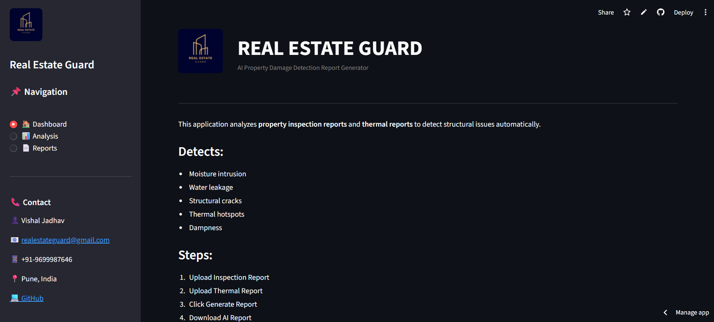
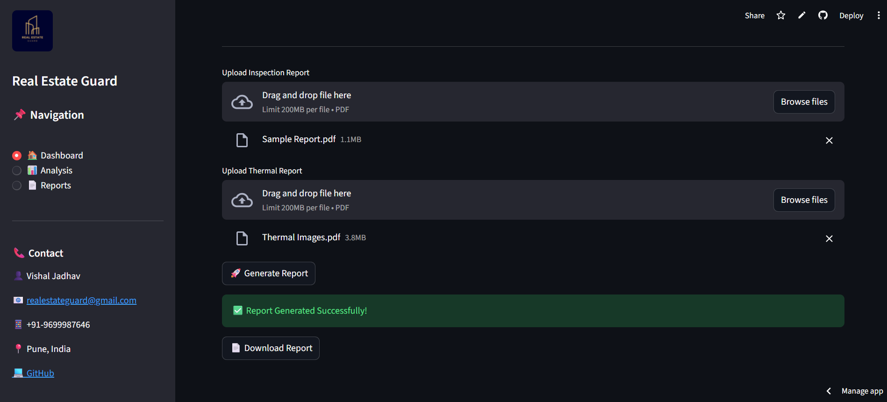
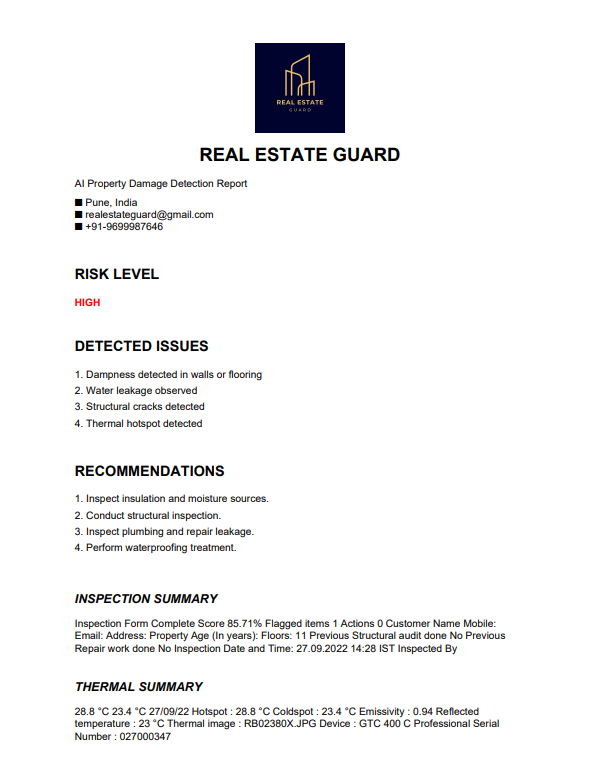

# 🏢 Real Estate Guard (AI Property Damage Detection System)

## 📌 Problem
Property inspection is often manual, time-consuming, and prone to human error.  
Critical issues like:
- 💧 Moisture intrusion  
- 🚰 Water leakage  
- 🧱 Structural cracks  
- 🌡️ Thermal hotspots  

can be overlooked, leading to:
- 💸 Expensive repairs  
- ⚠️ Safety risks  
- 📉 Property value loss  

👉 There is a need for an **AI-driven system** that can analyze reports and detect issues accurately.

---

## 💡 Solution
Developed an **AI-based property damage detection system** that analyzes inspection and thermal imaging reports to identify structural issues and generate professional reports.

Key functionalities:
- 🔍 Detects moisture, leakage, cracks, and thermal anomalies  
- 📄 Processes inspection reports automatically  
- 🌡️ Analyzes thermal imaging data for hidden issues  
- 🧠 Uses AI to identify patterns and potential damage  
- 📝 Generates structured, professional damage reports  

---

## 🧠 Methodology

- 📂 Input: Inspection reports + thermal imaging data  
- 🧹 Data preprocessing and feature extraction  
- 🤖 AI-based analysis for damage detection  
- 🔍 Pattern recognition for identifying anomalies  
- 📄 Automated report generation  

---

## 🛠️ Tech Used
- 🐍 Python  
- 🤖 Machine Learning / AI  
- 📊 Pandas, NumPy  
- 🌐 Streamlit (if deployed as app)  
- 📄 Report generation (PDF/structured output)  

---

## 📊 Results

Key outcomes:

- 🔍 Accurate detection of structural and moisture-related issues  
- ⚡ Faster inspection compared to manual methods  
- 📄 Automated professional report generation  
- 📉 Reduced chances of missing critical damage  

👉 Business Impact:
- Improves property inspection efficiency  
- Reduces maintenance costs  
- Enhances decision-making for buyers and inspectors  

---

## 📷 Screenshots

### 🏠 Home Interface


### 📥 Input / Upload


### 🔍 Detection Result


---

## 🚀 Live Demo

👉 [Click here to try the app](https://aiddrgenerator-cxwvwjy9xvzkbyyhgqpjjc.streamlit.app/)

## 🚀 Future Improvements

- 🤖 Improve model accuracy using deep learning (CNN for image analysis)  
- 🌍 Integrate real-time inspection tools (mobile capture)  
- ☁️ Deploy on cloud for large-scale usage  
- 📊 Add dashboard for property health monitoring  
- 🔐 Add user roles (inspectors, buyers, agents)  

---

## 🛠️ Installation & Setup

### 1️⃣ Clone the repository
```bash
git clone https://github.com/VishalJadhav-codes/Real_Estate_Guard.git
cd Real_Estate_Guard
```
### 2️⃣ Install dependencies
pip install -r requirements.txt

### 3️⃣ Run the application
streamlit run app.py

## 📬 Connect With Me
- 📧 Email: vishaljadhav12119036@gmail.com  
- 💼 LinkedIn: www.linkedin.com/in/vishaljadhav01  
